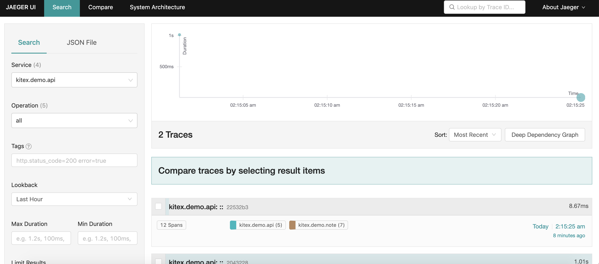
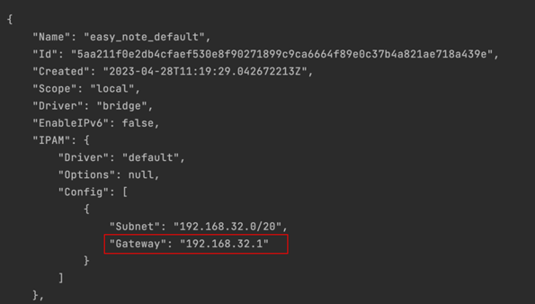

# Easy Note

English | [中文](./README_CN.md)

## Introduction

Add a demo for `kitex` which implements a simple note service,the demo is divided into three main sections.

| Service Name | Usage                | Framework   | protocol | Path                       | IDL                               |
| ------------ | -------------------- | ----------- | -------- | -------------------------- | --------------------------------- |
| demoapi      | http interface       | kitex/hertz | http     | bizdemo/easy_note/cmd/api  |                                   |
| demouser     | user data management | kitex/gorm  | protobuf | bizdemo/easy_note/cmd/user | bizdemo/easy_note/idl/user.proto  |
| demonote     | note data management | kitex/gorm  | thrift   | bizdemo/easy_note/cmd/note | bizdemo/easy_note/idl/note.thrift |

### call relations

```
                                    http
                           ┌────────────────────────┐
 ┌─────────────────────────┤                        ├───────────────────────────────┐
 │                         │         demoapi        │                               │
 │      ┌──────────────────►                        │◄──────────────────────┐       │
 │      │                  └───────────▲────────────┘                       │       │
 │      │                              │                                    │       │
 │      │                              │                                    │       │
 │      │                              │                                    │       │
 │      │                           resolve                                 │       │
 │      │                              │                                    │       │
req    resp                            │                                   resp    req
 │      │                              │                                    │       │
 │      │                              │                                    │       │
 │      │                              │                                    │       │
 │      │                   ┌──────────▼─────────┐                          │       │
 │      │                   │                    │                          │       │
 │      │       ┌───────────►       Etcd         ◄─────────────────┐        │       │
 │      │       │           │                    │                 │        │       │
 │      │       │           └────────────────────┘                 │        │       │
 │      │       │                                                  │        │       │
 │      │     register                                           register   │       │
 │      │       │                                                  │        │       │
 │      │       │                                                  │        │       │
 │      │       │                                                  │        │       │
 │      │       │                                                  │        │       │
┌▼──────┴───────┴───┐                                           ┌──┴────────┴───────▼─┐
│                   │───────────────── req ────────────────────►│                     │
│       demonote    │                                           │        demouser     │
│                   │◄──────────────── resp ────────────────────│                     │
└───────────────────┘                                           └─────────────────────┘
      thrift                                                           protobuf
```

### Use Basic Features

- Middleware、Rate Limiting、Request Retry、Timeout Control、Connection Multiplexing
- Tracing
  - use jaeger to tracing
- Customized BoundHandler
  - achieve CPU utilization rate customized bound handler
- Service Discovery and Register
  - use [registry-etcd](https://github.com/kitex-contrib/registry-etcd) to discovery and register service

### catalog introduce

| catalog        | introduce                |
| -------------- | ------------------------ |
| pkg/constants  | constant                 |
| pkg/bound      | customized bound handler |
| pkg/errno      | customized error number  |
| pkg/middleware | RPC middleware           |
| pkg/tracer     | init jaeger              |
| dal            | db operation             |
| pack           | data pack                |
| service        | business logic           |

## Quick Start

### 1.Setup Basic Dependence

```shell
docker compose up
```

### 2.Run Note RPC Server

```shell
cd cmd/note
sh build.sh
sh output/bootstrap.sh
```

### 3.Run User RPC Server

```shell
cd cmd/user
sh build.sh
sh output/bootstrap.sh
```

### 4.Run API Server

```shell
cd cmd/api
chmod +x run.sh
./run.sh
```

### 5.Jaeger

visit `http://127.0.0.1:16686/` on browser.

#### Snapshots



## Custom Error Code

Customise the response error code in the `errno` package.

```go
const (
    SuccessCode                = 0
    ServiceErrCode             = 10001
    ParamErrCode               = 10002
    UserAlreadyExistErrCode    = 10003
    AuthorizationFailedErrCode = 10004
)
```

Sample code : Replace the default error code for hertz-jwt authentication error with a custom error code.

```go
authMiddleware, _ := jwt.New(&jwt.HertzJWTMiddleware{
    Unauthorized: func(ctx context.Context, c *app.RequestContext, code int, message string) {
        c.JSON(code, map[string]interface{}{
            "code":    errno.AuthorizationFailedErrCode,
            "message": message,
        })
    },
    //Unauthorized: func(ctx context.Context, c *app.RequestContext, code int, message string) {
    //  c.JSON(code, map[string]interface{}{
    //      "code":    code,
    //      "message": message,
    //  })
    //}
})
```

## Deploy with docker

### 1.Setup Basic Dependence

```shell
docker compose up
```

### 2.Get Default Network Gateway Ip

`docker compose up` will create a default bridge network for mysql,etcd and jaeger.
Get the gateway ip of this default network to reach three components.

```shell
docker inspect easy_note_default
```



### 3.Replace ip in Dockerfile

You can use gateway ip in `step 2` to replace MysqlIp , EtcdIp and JAEGER_AGENT_HOST.

- UserDockerfile:

  ```dockerfile
  FROM golang:1.17.2
  ENV GO111MODULE=on
  ENV GOPROXY="https://goproxy.io"
  ENV MysqlIp="your MysqlIp"
  ENV EtcdIp="your EtcdIp"
  ENV JAEGER_AGENT_HOST="your JAEGER_AGENT_HOST"
  ENV JAEGER_DISABLED=false
  ENV JAEGER_SAMPLER_TYPE="const"
  ENV JAEGER_SAMPLER_PARAM=1
  ENV JAEGER_REPORTER_LOG_SPANS=true
  ENV JAEGER_AGENT_PORT=6831
  WORKDIR $GOPATH/src/easy_note
  COPY . $GOPATH/src/easy_note
  WORKDIR $GOPATH/src/easy_note/cmd/user
  RUN ["sh", "build.sh"]
  EXPOSE 8889
  ENTRYPOINT ["./output/bin/demouser"]
  ```

- NoteDockerfile:

  ```dockerfile
  FROM golang:1.17.2
  ENV GO111MODULE=on
  ENV GOPROXY="https://goproxy.io"
  ENV MysqlIp="your MysqlIp"
  ENV EtcdIp="your EtcdIp"
  ENV JAEGER_AGENT_HOST="your JAEGER_AGENT_HOST"
  ENV JAEGER_DISABLED=false
  ENV JAEGER_SAMPLER_TYPE="const"
  ENV JAEGER_SAMPLER_PARAM=1
  ENV JAEGER_REPORTER_LOG_SPANS=true
  ENV JAEGER_AGENT_PORT=6831
  WORKDIR $GOPATH/src/easy_note
  COPY . $GOPATH/src/easy_note
  WORKDIR $GOPATH/src/easy_note/cmd/note
  RUN ["sh", "build.sh"]
  EXPOSE 8888
  ENTRYPOINT ["./output/bin/demonote"]
  ```

- ApiDockerfile:
  ```dockerfile
  FROM golang:1.17.2
  ENV GO111MODULE=on
  ENV GOPROXY="https://goproxy.io"
  ENV MysqlIp="your MysqlIp"
  ENV EtcdIp="your EtcdIp"
  ENV JAEGER_AGENT_HOST="your JAEGER_AGENT_HOST"
  ENV JAEGER_DISABLED=false
  ENV JAEGER_SAMPLER_TYPE="const"
  ENV JAEGER_SAMPLER_PARAM=1
  ENV JAEGER_REPORTER_LOG_SPANS=true
  ENV JAEGER_AGENT_PORT=6831
  WORKDIR $GOPATH/src/easy_note
  COPY . $GOPATH/src/easy_note
  WORKDIR $GOPATH/src/easy_note/cmd/api
  RUN go build -o main .
  EXPOSE 8080
  ENTRYPOINT ["./main"]
  ```

### 4.Build images from Dockerfile

```shell
docker build -t easy_note/user -f UserDockerfile .
docker build -t easy_note/note -f NoteDockerfile .
docker build -t easy_note/api -f ApiDockerfile .
```

### 5.Run containers

- Run containers in `easy_note_default` network with the subnet inspected in the Step 2.
  ```shell
  docker run -d --name user --network easy_note_default easy_note/user
  docker run -d --name note --network easy_note_default easy_note/note
  docker run -d -p 8080:8080 --name api --network easy_note_default easy_note/api
  ```

## API requests

[API requests](api.md)

## Faq

### How to upgrade kitex_gen

- refer to [Makefile](Makefile)
