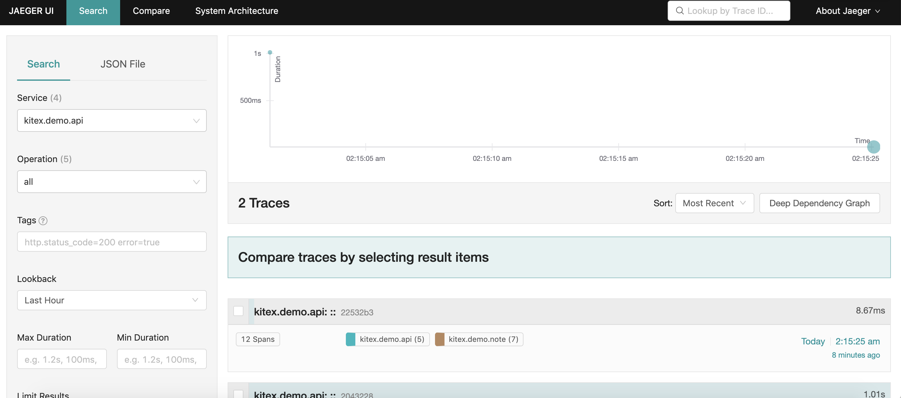

# 简单笔记

[English](./README.md) | 中文

## 介绍

添加一个 `kitex` 的 demo，它实现了一个简单的笔记服务，该 demo 分为三个主要部分。

| 服务名   | 用法         | 框架        | 协议     | 路径                       | IDL                               |
| -------- | ------------ | ----------- | -------- | -------------------------- | --------------------------------- |
| demoapi  | http 接口    | kitex/hertz | http     | bizdemo/easy_note/cmd/api  |                                   |
| demouser | 用户信息管理 | kitex/gorm  | protobuf | bizdemo/easy_note/cmd/user | bizdemo/easy_note/idl/user.proto  |
| demonote | 笔记信息管理 | kitex/gorm  | thrift   | bizdemo/easy_note/cmd/note | bizdemo/easy_note/idl/note.thrift |

### 调用关系

```
                                    http
                           ┌────────────────────────┐
 ┌─────────────────────────┤                        ├───────────────────────────────┐
 │                         │         demoapi        │                               │
 │      ┌──────────────────►                        │◄──────────────────────┐       │
 │      │                  └───────────▲────────────┘                       │       │
 │      │                              │                                    │       │
 │      │                              │                                    │       │
 │      │                              │                                    │       │
 │      │                           resolve                                 │       │
 │      │                              │                                    │       │
req    resp                            │                                   resp    req
 │      │                              │                                    │       │
 │      │                              │                                    │       │
 │      │                              │                                    │       │
 │      │                   ┌──────────▼─────────┐                          │       │
 │      │                   │                    │                          │       │
 │      │       ┌───────────►       Etcd         ◄─────────────────┐        │       │
 │      │       │           │                    │                 │        │       │
 │      │       │           └────────────────────┘                 │        │       │
 │      │       │                                                  │        │       │
 │      │     register                                           register   │       │
 │      │       │                                                  │        │       │
 │      │       │                                                  │        │       │
 │      │       │                                                  │        │       │
 │      │       │                                                  │        │       │
┌▼──────┴───────┴───┐                                           ┌──┴────────┴───────▼─┐
│                   │───────────────── req ────────────────────►│                     │
│       demonote    │                                           │        demouser     │
│                   │◄──────────────── resp ────────────────────│                     │
└───────────────────┘                                           └─────────────────────┘
      thrift                                                           protobuf
```

### 使用基本功能

- 中间件、速率限制、请求重试、超时控制、连接复用
- 追踪
  - 使用 jaeger 进行追踪
- 定制 BoundHandler
  - 实现CPU利用率自定义绑定 handler
- 服务发现和注册
  - 使用 [registry-etcd](https://github.com/kitex-contrib/registry-etcd) 发现并注册服务

### 目录介绍

| 目录           | 介绍             |
| -------------- | ---------------- |
| pkg/constants  | 常数             |
| pkg/bound      | 定制绑定处理程序 |
| pkg/errno      | 自定义错误码     |
| pkg/middleware | RPC 中间件       |
| pkg/tracer     | 初始化 Jaeger    |
| dal            | 数据库操作       |
| pack           | 数据包           |
| service        | 业务逻辑         |

## 快速开始

### 1.设置基本依赖

```shell
docker compose up
```

### 2.运行 Note RPC 服务器

```shell
cd cmd/note
sh build.sh
sh output/bootstrap.sh
```

### 3.运行用户 RPC 服务器

```shell
cd cmd/user
sh build.sh
sh output/bootstrap.sh
```

### 4.运行API服务器

```shell
cd cmd/api
chmod +x run.sh
./run.sh
```

### 5.Jaeger

在浏览器上访问 `http://127.0.0.1:16686/`

#### 快照



## 自定义错误代码

在 `errno` 包中自定义响应错误代码。

```go
const (
    SuccessCode                = 0
    ServiceErrCode             = 10001
    ParamErrCode               = 10002
    UserAlreadyExistErrCode    = 10003
    AuthorizationFailedErrCode = 10004
)
```

示例代码：将 hertz-jwt 身份验证错误的默认错误代码替换为自定义错误代码。

```go
authMiddleware, _ := jwt.New(&jwt.HertzJWTMiddleware{
    Unauthorized: func(ctx context.Context, c *app.RequestContext, code int, message string) {
        c.JSON(code, map[string]interface{}{
            "code":    errno.AuthorizationFailedErrCode,
            "message": message,
        })
    },
    //Unauthorized: func(ctx context.Context, c *app.RequestContext, code int, message string) {
    //  c.JSON(code, map[string]interface{}{
    //      "code":    code,
    //      "message": message,
    //  })
    //}
})
```

## 使用 Docker 部署

### 1.设置基本依赖

```shell
docker compose up
```

### 2.获取网关 IP

`docker compose up` 将为 mysql、etcd 和 jaeger 创建一个默认的桥接网络。
获取此默认网络中的网关 IP 以访问三个组件。

```shell
docker inspect easy_note_default
```


### 3.在 Dockerfile 中替换 ip

您可以在 `step 2` 中使用网关 ip 来替换 MysqlIp 、EtcdIp 和 JAEGER_AGENT_HOST 。

- UserDockerfile:

  ```dockerfile
  FROM golang:1.17.2
  ENV GO111MODULE=on
  ENV GOPROXY="https://goproxy.io"
  ENV MysqlIp="your MysqlIp"
  ENV EtcdIp="your EtcdIp"
  ENV JAEGER_AGENT_HOST="your JAEGER_AGENT_HOST"
  ENV JAEGER_DISABLED=false
  ENV JAEGER_SAMPLER_TYPE="const"
  ENV JAEGER_SAMPLER_PARAM=1
  ENV JAEGER_REPORTER_LOG_SPANS=true
  ENV JAEGER_AGENT_PORT=6831
  WORKDIR $GOPATH/src/easy_note
  COPY . $GOPATH/src/easy_note
  WORKDIR $GOPATH/src/easy_note/cmd/user
  RUN ["sh", "build.sh"]
  EXPOSE 8889
  ENTRYPOINT ["./output/bin/demouser"]
  ```

- NoteDockerfile:

  ```dockerfile
  FROM golang:1.17.2
  ENV GO111MODULE=on
  ENV GOPROXY="https://goproxy.io"
  ENV MysqlIp="your MysqlIp"
  ENV EtcdIp="your EtcdIp"
  ENV JAEGER_AGENT_HOST="your JAEGER_AGENT_HOST"
  ENV JAEGER_DISABLED=false
  ENV JAEGER_SAMPLER_TYPE="const"
  ENV JAEGER_SAMPLER_PARAM=1
  ENV JAEGER_REPORTER_LOG_SPANS=true
  ENV JAEGER_AGENT_PORT=6831
  WORKDIR $GOPATH/src/easy_note
  COPY . $GOPATH/src/easy_note
  WORKDIR $GOPATH/src/easy_note/cmd/note
  RUN ["sh", "build.sh"]
  EXPOSE 8888
  ENTRYPOINT ["./output/bin/demonote"]
  ```

- ApiDockerfile:
  ```dockerfile
  FROM golang:1.17.2
  ENV GO111MODULE=on
  ENV GOPROXY="https://goproxy.io"
  ENV MysqlIp="your MysqlIp"
  ENV EtcdIp="your EtcdIp"
  ENV JAEGER_AGENT_HOST="your JAEGER_AGENT_HOST"
  ENV JAEGER_DISABLED=false
  ENV JAEGER_SAMPLER_TYPE="const"
  ENV JAEGER_SAMPLER_PARAM=1
  ENV JAEGER_REPORTER_LOG_SPANS=true
  ENV JAEGER_AGENT_PORT=6831
  WORKDIR $GOPATH/src/easy_note
  COPY . $GOPATH/src/easy_note
  WORKDIR $GOPATH/src/easy_note/cmd/api
  RUN go build -o main .
  EXPOSE 8080
  ENTRYPOINT ["./main"]
  ```

### 4.构建镜像

```shell
docker build -t easy_note/user -f UserDockerfile .
docker build -t easy_note/note -f NoteDockerfile .
docker build -t easy_note/api -f ApiDockerfile .
```

### 5.运行容器

- 在 `easy_note_default` 网络中运行容器，并使用步骤 2 中检查的子网。
  ```shell
  docker run -d --name user --network easy_note_default easy_note/user
  docker run -d --name note --network easy_note_default easy_note/note
  docker run -d -p 8080:8080 --name api --network easy_note_default easy_note/api
  ```

## API 请求

[API requests](api.md)

## Faq

### 怎么更新 kitex_gen

- 请查看 [Makefile](Makefile)
